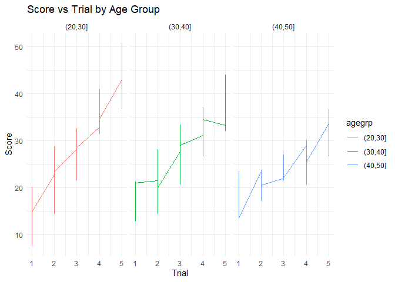
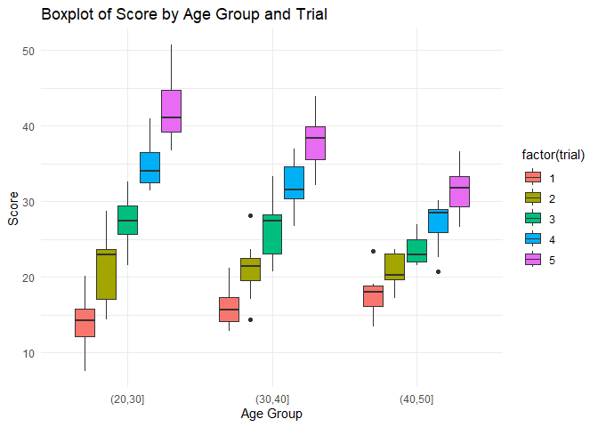
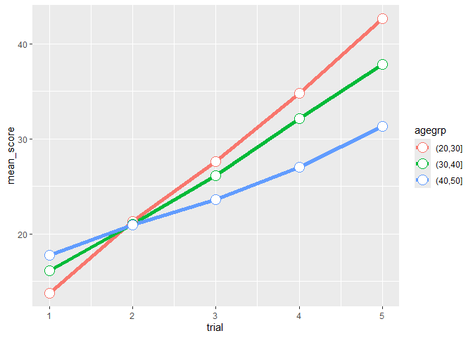
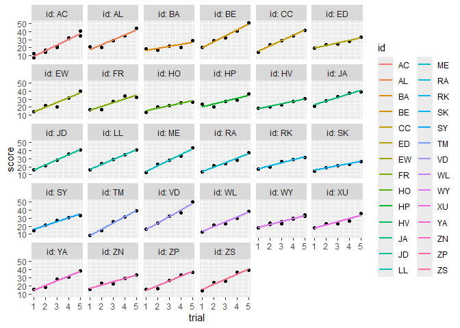

Load and View Data Set

    data = read_csv("mmvideo.csv")
    View(data)

Line Plot Score by Age Group and Trial

    ggplot(data, aes(x=trial, y=score, group = as.factor(agegrp), color = agegrp)) +
      geom_line() +
      facet_wrap(~as.factor(agegrp)) + 
      labs(title = "Score vs Trial by Age Group", x="Trial", y="Score") +
      theme_minimal()

Box Plot Score by Age Group and Trial

    ggplot(data, aes(x=agegrp, y=score, fill=factor(trial))) + 
      geom_boxplot() +
      labs(title="Boxplot of Score by Age Group and Trial", x="Age Group", y="Score")+
      theme_minimal()

    agegrp_condition = data |>
      group_by(agegrp, trial) |>
      summarize(mean_score = mean(score))

    ggplot(agegrp_condition, aes(x=trial, y=mean_score, color=agegrp, group=agegrp)) +
        geom_line(linewidth=2) + geom_point(size=5, shape=21, fill="white")

Plot Individual Regressions

    ggplot(data, aes(x=trial, y=score)) +
        geom_point() +
        geom_smooth(method="lm",aes(color=id),se=F) +
        scale_x_continuous(breaks=1:5) +
        facet_wrap("id", labeller = label_both)

Note: two subjects share the same id ‘AC’

Modeling

    # Simple Linear Regression Model:
    # Fixed effects for 'agegrp' and 'trial'. No random effects.
    mod1 = lm(score ~ agegrp + trial, data)

    # Mixed Effect Models:
    # Fixed effect for 'trial', random intercept for 'id'.
    mod2 = lmer(score ~ trial + (1|id), data)

    # Fixed effects for 'agegrp' and 'trial', random intercept for 'id'.
    mod3 = lmer(score ~ agegrp + trial + (1|id), data)

    # Fixed effects for 'agegrp' and 'trial', random intercept and slope for 'id'.
    mod4 = lmer(score ~ agegrp + trial + (1 + trial|id), data)

    AIC(mod1)

    ## [1] 840.7906

    AIC(mod2)

    ## [1] 823.7025

    AIC(mod3)

    ## [1] 813.9751

    AIC(mod4)

    ## [1] 771.9439

    # Best Model Summary & Confint:
    summary(mod4)

    ## Linear mixed model fit by REML ['lmerMod']
    ## Formula: score ~ agegrp + trial + (1 + trial | id)
    ##    Data: data
    ## 
    ## REML criterion at convergence: 755.9
    ## 
    ## Scaled residuals: 
    ##      Min       1Q   Median       3Q      Max 
    ## -2.41653 -0.56448  0.04112  0.56414  2.11091 
    ## 
    ## Random effects:
    ##  Groups   Name        Variance Std.Dev. Corr 
    ##  id       (Intercept) 17.634   4.199         
    ##           trial        2.246   1.499    -0.81
    ##  Residual              4.577   2.139         
    ## Number of obs: 150, groups:  id, 28
    ## 
    ## Fixed effects:
    ##               Estimate Std. Error t value
    ## (Intercept)    11.7098     1.1149  10.503
    ## agegrp(30,40]  -0.6880     0.9343  -0.736
    ## agegrp(40,50]  -2.1164     1.2175  -1.738
    ## trial           5.1782     0.3097  16.719
    ## 
    ## Correlation of Fixed Effects:
    ##             (Intr) a(30,4 a(40,5
    ## aggr(30,40] -0.507              
    ## aggr(40,50] -0.512  0.464       
    ## trial       -0.664  0.000  0.001

    confint(mod4)

    ##                    2.5 %     97.5 %
    ## .sig01         2.3277586  6.4788284
    ## .sig02        -0.9355457 -0.4566773
    ## .sig03         1.0752506  2.0402779
    ## .sigma         1.8623841  2.4763395
    ## (Intercept)    9.1822309 14.6877899
    ## agegrp(30,40] -2.7545807  1.3747483
    ## agegrp(40,50] -6.7042514  2.4138213
    ## trial          4.5609480  5.7957231

    # Analysis:
    # At alpha = 0. 05
    # Effects of agegrp not statistically significant
    # Effects of trial are statistically significant
