## Exercise 1

Derive the least squares estimates for *β*0 and
*β*1 in the simple linear regression model. That is, show
that
$$\sum\_{i=1}^n(y\_i-(b\_0+b\_1x))^2$$
is minimized when
$$b\_1=\frac{SS\_{xy}}{SS\_{x}}=\frac{\sum\_{i=1}^n x\_iy\_i-\frac{1}{n}\sum\_{i=1}^nx\_i\sum\_{i=1}^ny\_i}{\sum\_{i=1}^nx\_i^2-\frac{1}{n}\left(\sum\_{i=1}^nx\_i\right)^2} $$
and
$$b\_0=\overline{y}-b\_1\overline{x}.$$

You can upload an image of your handwritten work.

## Exercise 2

Load the Survey package and access the apisrs data. Check out all the
variable definitions by putting apipop into the help search a. Create a
filtered data set containing only the elementary schools. Call this data
set apiel. Use it for the rest of this problem. b. Create two
correlation matrices with ggpairs to look at how api00 relates to the
other numeric variables in the data set. One matrix should include api00
with columns 11, 20, 21, 23-26, and 34-36. The other should include the
parental education variables in columns 27-30. Do not consider api99,
target, or growth in this analysis. Comment on which variables are
strongly associated and whether the association is positive or negative.
c. Create a linear regression model predicting api00 with meals. Output
the summary data. d. Check the assumptions about residuals graphically.
Comment on whether the linear model seems appropriate here. e. Conduct a
hypothesis test of the null that the slope is zero versus the
alternative that the slope is negative. Include all steps of the
hypothesis test. f. Plot api00 versus meals using ggplot. Include the
confidence band for the line. Add in the prediction ribbon for new
observations using 95% confidence. g. Compute a 90% prediction interval
for a school where 50 percent of students receive meals. Give a sentence
interpreting this interval. h. Identify the 5 schools with percent
receiving meals over 50 that have the largest positive residuals. These
schools are doing well and may have programs others can emulate.

    library(tidyverse)

    ## ── Attaching core tidyverse packages ──────────────────────── tidyverse 2.0.0 ──
    ## ✔ dplyr     1.1.4     ✔ readr     2.1.5
    ## ✔ forcats   1.0.0     ✔ stringr   1.5.1
    ## ✔ ggplot2   3.5.2     ✔ tibble    3.2.1
    ## ✔ lubridate 1.9.3     ✔ tidyr     1.3.1
    ## ✔ purrr     1.0.2     
    ## ── Conflicts ────────────────────────────────────────── tidyverse_conflicts() ──
    ## ✖ dplyr::filter() masks stats::filter()
    ## ✖ dplyr::lag()    masks stats::lag()
    ## ℹ Use the conflicted package (<http://conflicted.r-lib.org/>) to force all conflicts to become errors

    #install.packages("GGally")
    library(GGally)

    ## Registered S3 method overwritten by 'GGally':
    ##   method from   
    ##   +.gg   ggplot2

    #install.packages("survey")
    library(survey)

    ## Loading required package: grid
    ## Loading required package: Matrix
    ## 
    ## Attaching package: 'Matrix'
    ## 
    ## The following objects are masked from 'package:tidyr':
    ## 
    ##     expand, pack, unpack
    ## 
    ## Loading required package: survival
    ## 
    ## Attaching package: 'survey'
    ## 
    ## The following object is masked from 'package:graphics':
    ## 
    ##     dotchart

    data(api, package="survey")
    # View(apisrs)

    # 2. a.
    apiel = apisrs |>
      filter(stype == "E")
    # View(apiel)

    # 2. b.
    plot1 = ggpairs( select(apiel, api00, 11, 20, 21, 23:26, 34:36) )
    ggpairs( select(apiel, api00, 27:30) )

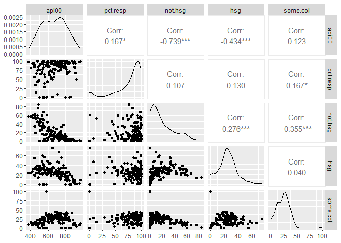

    # First ggpair correlation matrix: The numeric variables with a strong linear correlation (0.7, 1.0) with api00 are meals and ell with r values of -0.893 and -0.714 respectively. The variables meals and ell were negatively correlated with api00. Variables with a moderate to lower correlation (0.3, 0.7) were full, emer, and mobility with r values of 0.441, -0.395, and -0.308 respectively. The variables emer and mobility were negatively correlated with api00. The remaining numeric variables had low to no linear correlation (0.0, 0.3). 
    # Second ggpair correlation matrix: The numeric variable with a strong linear correlation (0.7, 1.0) with api00 is not.hsg with an r value of -0.739 and is negatively correlated. hsg has a moderate negative linear correlation (0.3, 0.7) with and r value of -0.434. The remaining numeric variables have little to no linear correlation (0.0, 0.3) with api00.

    # saved plot for better readability.
    ggsave("ggpairs_output.png", plot1, width = 10, height = 10, units = "in")

    # 2. c. 
    model = lm(api00 ~ meals, data = apiel)
    summary(model)

    ## 
    ## Call:
    ## lm(formula = api00 ~ meals, data = apiel)
    ## 
    ## Residuals:
    ##      Min       1Q   Median       3Q      Max 
    ## -222.992  -40.583    1.258   34.059  167.008 
    ## 
    ## Coefficients:
    ##             Estimate Std. Error t value Pr(>|t|)    
    ## (Intercept) 882.6614    10.5681   83.52   <2e-16 ***
    ## meals        -3.9667     0.1691  -23.46   <2e-16 ***
    ## ---
    ## Signif. codes:  0 '***' 0.001 '**' 0.01 '*' 0.05 '.' 0.1 ' ' 1
    ## 
    ## Residual standard error: 61.34 on 140 degrees of freedom
    ## Multiple R-squared:  0.7972, Adjusted R-squared:  0.7958 
    ## F-statistic: 550.3 on 1 and 140 DF,  p-value: < 2.2e-16

    # 2. d.
    linear_residuals = resid(model)
    #check for homoscedasticity (constant variance of residuals) and independence of errors.
    plot(linear_residuals)

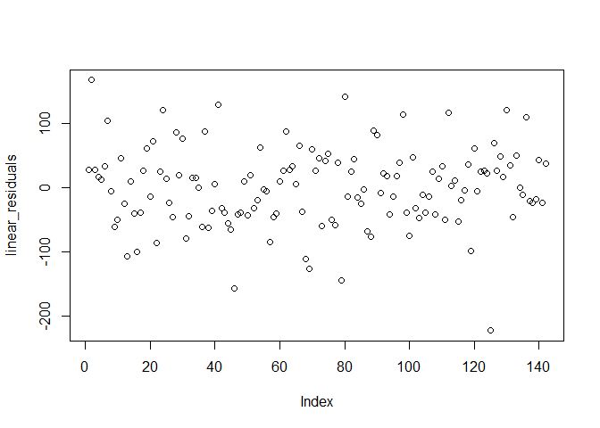

    #check for normality
    plot(density(linear_residuals), main = "Density Plot of Residuals")

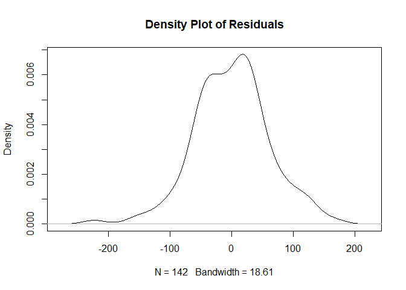

    shapiro.test(linear_residuals)$p.value

    ## [1] 0.1953457

    #plots for linear model
    plot(model)

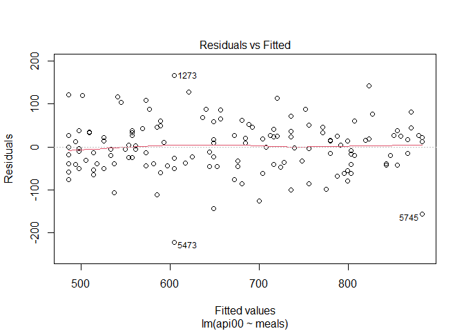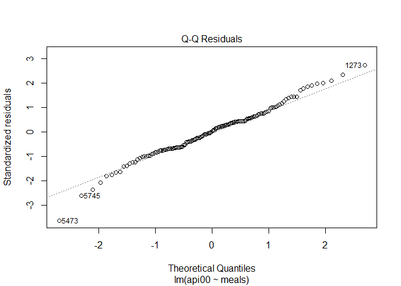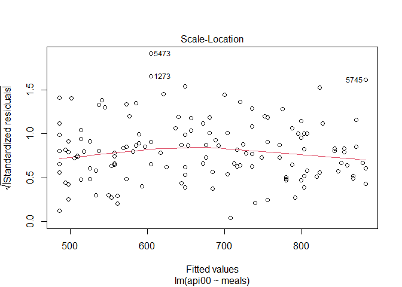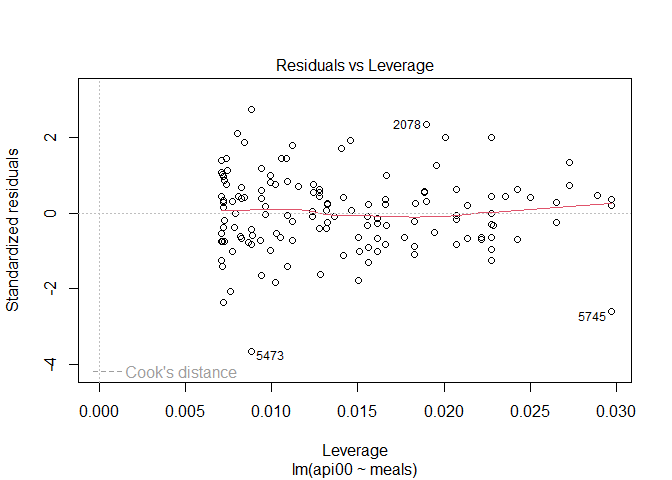

    # The linear model for api00 with respect to meals appears appropriate according to the residual plots. There are no discernible patterns to be observed among the residual points and the normal qq plot follows an approximately straight line. 

    # 2. e. 
    summary(model)

    ## 
    ## Call:
    ## lm(formula = api00 ~ meals, data = apiel)
    ## 
    ## Residuals:
    ##      Min       1Q   Median       3Q      Max 
    ## -222.992  -40.583    1.258   34.059  167.008 
    ## 
    ## Coefficients:
    ##             Estimate Std. Error t value Pr(>|t|)    
    ## (Intercept) 882.6614    10.5681   83.52   <2e-16 ***
    ## meals        -3.9667     0.1691  -23.46   <2e-16 ***
    ## ---
    ## Signif. codes:  0 '***' 0.001 '**' 0.01 '*' 0.05 '.' 0.1 ' ' 1
    ## 
    ## Residual standard error: 61.34 on 140 degrees of freedom
    ## Multiple R-squared:  0.7972, Adjusted R-squared:  0.7958 
    ## F-statistic: 550.3 on 1 and 140 DF,  p-value: < 2.2e-16

    #get test statistic
    t_stat = summary(model)$coefficients['meals','t value']
    #get p-value
    p_val = summary(model)$coefficients['meals','Pr(>|t|)']
    confint(model)

    ##                  2.5 %     97.5 %
    ## (Intercept) 861.767719 903.555066
    ## meals        -4.300999  -3.632407

    # Hypothesis Test Steps:
    # 1. H0: the slope of the linear model is b1= 0  Ha: the slope of the linear model is negative b1< 0 
    # 2. Based on the above test (d) we can conclude that the assumption of normality is met, we also know the data is independent.
    # 3. The test statistic (F-value) is `r t_stat`
    # 4. p-value is `r p_val` which is nearly 0.
    # 5. Since the p-value of `r p_val`  is less than the level of significance (0.05) we can conclude there is sufficient evidence to reject the null and conclude the slope of the linear model is negative (<0).

    # The estimate for the slope of the linear regression of api00 with respect to meals is -3.9667 with a p-value of 2.2*10^-16 and has a 95% conf int of (-4.30, -3.63). Because the p-value is significantly lower than the 0.05 level of significance alpha, as well as because the conf int does not contain 0, we have enough evidence to conclude that the slope of the linear regression is negative with statistic significance.

    # 2. f.
    pred.int = as.data.frame(predict(model, interval = "prediction"))

    ## Warning in predict.lm(model, interval = "prediction"): predictions on current data refer to _future_ responses

    apiel1 = bind_cols(apiel, pred.int)

    ggplot(data = apiel1, mapping = aes(x= meals, y= api00)) +
      geom_point() +
      stat_smooth(method = "lm", level = 0.95) + 
      geom_line(aes(y = lwr, x=meals), color = "red", linetype = "dashed") +
      geom_line(aes(y = upr, x=meals), color = "red", linetype = "dashed") +
      labs(
        title = "meals vs api00",
        subtitle = "with 95% conf band and prediction ribbon",
        x = "meals", y = "api00"
      )

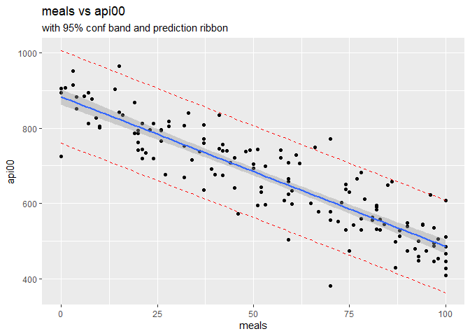

    # g. Compute a 90% prediction interval for a school where 50 percent of students receive meals.  Give a sentence interpreting this interval.
    # 2. g.
    meals_50 = data.frame(meals = c(50))
    predict(model, newdata =  meals_50, interval = "prediction", level = 0.9)

    ##        fit      lwr      upr
    ## 1 684.3262 582.3896 786.2628

    # We can interpret this to mean that the actual the value of api00 (Academic Performance Index for 2000) for a school where 50 percent of students receive meals will fall between between 582 and 786.

    # h. Identify the 5 schools with percent receiving meals over 50 that have the largest positive residuals.  These schools are doing well and may have programs others can emulate.
    # 2. h.
    #add residuals to the a copy of the apiel dataframe
    apiel_res <- bind_cols(apiel, residuals = linear_residuals)

    #filter to get only schools recieiving meals over 50 and arrange by largest residuals
    top_schools = apiel_res |>
    filter(meals > 50) |>
    arrange(desc(residuals))

    #print top 5
    top_schools[1:5,]

    ##                 cds stype            name                      sname snum
    ## 1273 19644516012744     E Alameda Element         Alameda Elementary 1273
    ## 2295 19649316022164     E Shuey (Emma W.) Shuey (Emma W.) Elementary 2295
    ## 3764 34674396034169     E Nicholas Elemen        Nicholas Elementary 3764
    ## 837  13631236008437     E Harding Element         Harding Elementary  837
    ## 3412 33670826032106     E Hemet Elementar           Hemet Elementary 3412
    ##                        dname dnum       cname cnum flag pcttest api00 api99
    ## 1273          Downey Unified  187 Los Angeles   18   NA      99   772   657
    ## 2295     Rosemead Elementary  613 Los Angeles   18   NA     100   749   724
    ## 3764 Sacramento City Unified  620  Sacramento   33   NA      99   607   529
    ## 837     El Centro Elementary  200    Imperial   12   NA     100   622   519
    ## 3412           Hemet Unified  298   Riverside   32   NA     100   658   634
    ##      target growth sch.wide comp.imp both awards meals ell yr.rnd mobility
    ## 1273      7    115      Yes      Yes  Yes    Yes    70  25   <NA>       23
    ## 2295      4     25      Yes      Yes  Yes    Yes    66  25   <NA>       12
    ## 3764     14     78      Yes      Yes  Yes    Yes   100  41   <NA>       29
    ## 837      14    103      Yes      Yes  Yes    Yes    96  56   <NA>       24
    ## 3412      8     24      Yes      Yes  Yes    Yes    86  21     No       25
    ##      acs.k3 acs.46 acs.core pct.resp not.hsg hsg some.col col.grad grad.sch
    ## 1273     23     NA       NA      100      37  40       14        8        1
    ## 2295     21     29       NA       86      33  55        0       10        2
    ## 3764     22     33       NA       68      33  44       16        7        1
    ## 837      19     33       NA       61      14  25       30       17       14
    ## 3412     20     31       NA       90      32  36       24        6        2
    ##      avg.ed full emer enroll api.stu    pw  fpc residuals
    ## 1273   1.96   85   18    342     291 30.97 6194  167.0078
    ## 2295   1.93   78   25    461     395 30.97 6194  128.1410
    ## 3764   2.00  100    9    429     357 30.97 6194  121.0089
    ## 837    2.92  100    4    397     353 30.97 6194  120.1421
    ## 3412   2.10   90    6    611     486 30.97 6194  116.4751

## Exercise 3

Continuing with the apiel dataset, consider predicting ell with meals.
The relationship between meals and ell shows some nonlinearity. Find a
transformation that produces a higher R^2 value without causing problems
in the residuals. Verify this graphically and comment on the
improvement. Note that if you add a new (transformed) variable to the
data set, it’s fine to use this new name in the formula. If you include
the math operators for the trasformation in your formula, you should use
the AsIs operator I() around your expression so the math operators are
not misinterpreted in the formula.

    # 3. 
    fit = lm(ell ~ meals + I(meals^2) + I(meals^3), data = apiel)
    # Multiple R^2 = 0.5278 with non normal or random residuals with no transformations.

    # failed attempt to plot transformed variable...
    # apiel$meals_trans = apiel$meals + I(apiel$meals)^2 + I(apiel$meals)^3
    # ggplot(data = apiel, mapping = aes(x= meals_trans, y= ell)) + 
    #  geom_point() +
    #  geom_abline(intercept = coef(fit)[1], slope = coef(fit)[2], color = "blue") +
    #  labs(
    #    title = "meals vs ell",
    #    subtitle = "with linear regression",
    #    x = "transformed meals", y = "ell"
    #)
    summary(fit)

    ## 
    ## Call:
    ## lm(formula = ell ~ meals + I(meals^2) + I(meals^3), data = apiel)
    ## 
    ## Residuals:
    ##     Min      1Q  Median      3Q     Max 
    ## -40.060  -8.693  -1.311   9.754  56.200 
    ## 
    ## Coefficients:
    ##               Estimate Std. Error t value Pr(>|t|)  
    ## (Intercept)  3.196e+00  4.648e+00   0.688   0.4929  
    ## meals        5.621e-01  3.862e-01   1.456   0.1478  
    ## I(meals^2)  -1.065e-02  8.768e-03  -1.215   0.2266  
    ## I(meals^3)   1.091e-04  5.623e-05   1.941   0.0543 .
    ## ---
    ## Signif. codes:  0 '***' 0.001 '**' 0.01 '*' 0.05 '.' 0.1 ' ' 1
    ## 
    ## Residual standard error: 14.27 on 138 degrees of freedom
    ## Multiple R-squared:  0.5891, Adjusted R-squared:  0.5802 
    ## F-statistic: 65.95 on 3 and 138 DF,  p-value: < 2.2e-16

    par(mfrow = c(2, 2))
    plot(fit, which = 1)
    plot(fit, which = 2)
    plot(fit, which = 3)
    plot(fit, which = 5)

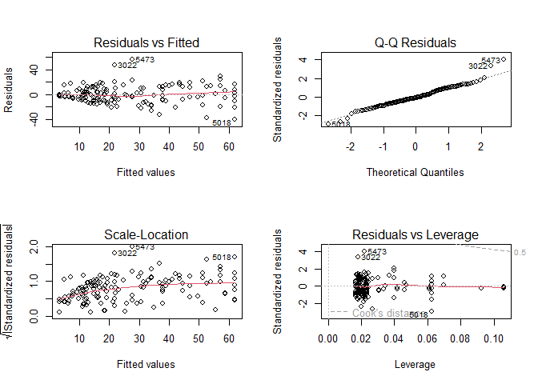

    # The transformation that produces the highest R^2 value is the cubic transformation with a multiple R^2 of 0.5891. 

## Exercise 4

1.  Fit a linear model called edmodel predicting api00 with average
    parent education (avg.ed).
2.  Give 95% confidence intervals for the slopes and intercepts of this
    model. The matrix summary(edmodel)$coefficients has the estimates in
    the first column and their standard errors in the second column.
3.  Evaluate the fit and predictive ability of this model. ie, how far
    off do you expect predictions to be on average, and what fraction of
    the variability in api00 can be explained by the regression on
    avg.ed?
4.  Calculate (*X*′*X*) for this model. Identify what values fall in
    each of the four slots (what formula would go in each generally)?

<!-- -->

    # 4. a.
    edmodel = lm(api00 ~ avg.ed, data = apiel)
    summary(edmodel)

    ## 
    ## Call:
    ## lm(formula = api00 ~ avg.ed, data = apiel)
    ## 
    ## Residuals:
    ##      Min       1Q   Median       3Q      Max 
    ## -185.695  -46.453   -1.934   39.067  228.464 
    ## 
    ## Coefficients:
    ##             Estimate Std. Error t value Pr(>|t|)    
    ## (Intercept)  237.781     21.847   10.88   <2e-16 ***
    ## avg.ed       155.998      7.662   20.36   <2e-16 ***
    ## ---
    ## Signif. codes:  0 '***' 0.001 '**' 0.01 '*' 0.05 '.' 0.1 ' ' 1
    ## 
    ## Residual standard error: 67.39 on 135 degrees of freedom
    ##   (5 observations deleted due to missingness)
    ## Multiple R-squared:  0.7543, Adjusted R-squared:  0.7525 
    ## F-statistic: 414.5 on 1 and 135 DF,  p-value: < 2.2e-16

    # 4. b.
    confint(edmodel)

    ##                2.5 %   97.5 %
    ## (Intercept) 194.5735 280.9876
    ## avg.ed      140.8443 171.1511

    # The 95% conf int for the intercept is (194.57, 280.99) and for slope is (140.84, 171.15)

    # 4. c. 
    ggplot(data = apiel, mapping = aes(x= avg.ed, y= api00)) + 
      geom_point() +
      geom_abline(intercept = coef(edmodel)[1], slope = coef(edmodel)[2], color = "blue") +
      labs(
        title = "api00 vs avg.ed",
        subtitle = "with linear regression",
        x = "avg.ed", y = "api00"
      )

    ## Warning: Removed 5 rows containing missing values or values outside the scale range
    ## (`geom_point()`).

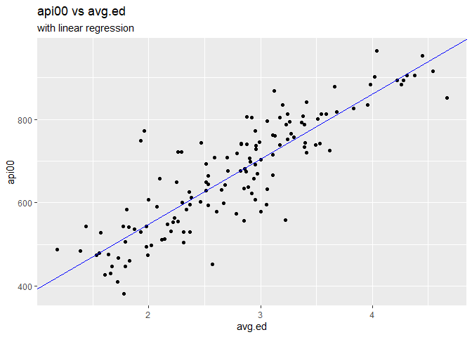

    par(mfrow = c(2, 2))
    plot(edmodel, which = 1)
    plot(edmodel, which = 2)
    plot(edmodel, which = 3)
    plot(edmodel, which = 5)

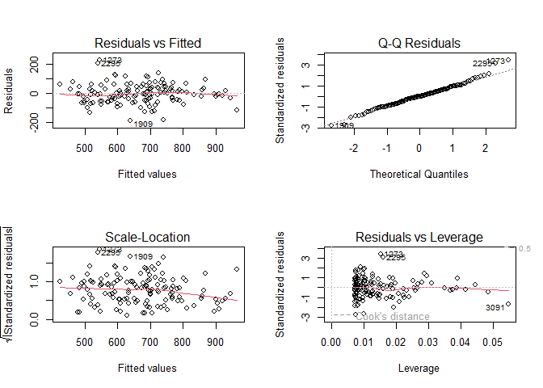

    # The linear regression has an r^2 value of 0.7543 meaning that there is a strong positive linear correlation. We expect predictions of api00 to be off by 67.39 on average, the residual standard error. The percent of variability in api00 explained by the regression model with avg.ed is 75.43%. With random and normal residual plots for the model, we can say that this model has good predictive ability.

    # 4. d.
    Xpx <- t(model.matrix(edmodel)) %*%
       model.matrix(edmodel)
    print(Xpx)

    ##             (Intercept)   avg.ed
    ## (Intercept)      137.00  376.820
    ## avg.ed           376.82 1113.804

    # Slot (1,1) or 137.00 represents the number of observations in the dataset, slot (1,2) and slot (2,1) represents the sum of the balues in the avg.ed column. Finally slot (2,2) represents the sum of the squared values in the avg.ed column. 
